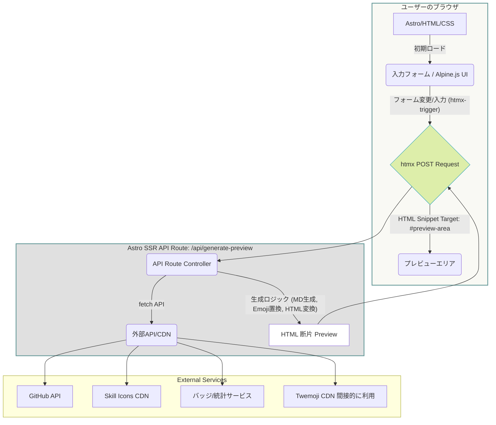

-----

## 🏗️ 技術アーキテクチャ設計書

### 1\. 技術スタック (Technology Stack)

| カテゴリ | 技術 | 役割 | 備考 |
| :--- | :--- | :--- | :--- |
| **フレームワーク** | Astro | **サーバーサイドレンダリング (SSR) mode** | アプリケーションの骨格と**API Route**（サーバー側エンドポイント）の提供。 |
| **通信/レンダリング** | **htmx** | **サーバー駆動型UIの実現** | フォーム入力の変更を検知し、サーバーへリクエストを送り、サーバーからのHTML断片でDOMを更新する。 |
| **クライアントロジック**| Alpine.js | UI補助、局所的な状態管理 | 絵文字パレットの表示/非表示、コピー機能など、サーバー通信が不要な局所的なUI制御のみに使用。 |
| **スタイリング** | Tailwind CSS | UI構成、デザインコンセプトの適用 | 「間（ま）の美学」に基づくスタイリング。 |
| **ホスティング** | Cloudflare Pages (Functions) | **サーバーレス環境** | Astro SSRを動作させるための環境。 |

-----

### 2\. システム構成図 (Mermaid Diagram)

システムの中核が**Astro API Route**に移行します。htmxがクライアントとサーバー間の主要な通信チャネルとなります。

-----

### 3\. AHAstack 各要素の役割 (SSRモード)

| 要素 | 役割 | 詳細 |
| :--- | :--- | :--- |
| **Astro (SSR)** | **サーバーロジックとルーティング** | 1. **初期HTML配信:** htmx属性を含むベースHTMLを配信。 2. **API Routeの実行:** htmxリクエストを受け取り、マークダウン生成・外部API通信・HTML変換のすべての処理を実行する。 |
| **htmx** | **非同期通信の駆動** | 1. **イベント検知:** フォーム入力やチェックボックスの変更を `hx-trigger` で検知。 2. **リクエスト:** データをサーバーのAPI Routeへ `hx-post` で送信。 3. **DOM更新:** サーバーから返された**HTML断片**（プレビュー）を `hx-target` に指定されたDOM要素に挿入し、**ページ全体をリロードせずに**プレビューをリアルタイム更新する。 |
| **Alpine.js** | **局所的なUI補助** | 1. **絵文字パレット:** クリック時の入力フィールドへの絵文字挿入や、パレットの表示/非表示制御など、純粋なクライアントサイドのUI機能。 2. **UIアニメーション:** フォーカス時の下線表示、コピーボタンのフィードバックなど、サーバー通信が不要な部分。 |

### 4\. 処理フローの詳細 (SSR主導)

#### 4.1. リアルタイムプレビューの実行シーケンス

1. **入力/操作 (クライアント):** ユーザーがフォーム（例: `username`）を変更する。
2. **htmx トリガー (クライアント):** `hx-trigger="input changed delay:500ms"` が発動し、フォームデータ全体を自動で収集する。
3. **POST リクエスト (クライアント → サーバー):** htmxが `/api/generate-preview` へフォームデータを送信する。
4. **API Route 実行 (サーバー):**
      * Astro API Routeがリクエストを受け取る。
      * **GitHub API等への通信を実行**し、データを収集する。
      * **絵文字置換**や**マークダウン生成**、**HTML変換**（Marked.js）の全ての重いロジックをサーバー側で実行する。
5. **HTML断片返却 (サーバー → クライアント):** サーバーは、生成したHTMLプレビュー部分のみをレスポンスボディとして返す（HTTPステータス 200）。
6. **DOM更新 (クライアント):** htmxが返されたHTML断片を `hx-target` で指定されたプレビューエリアに置き換え、画面が更新される。
